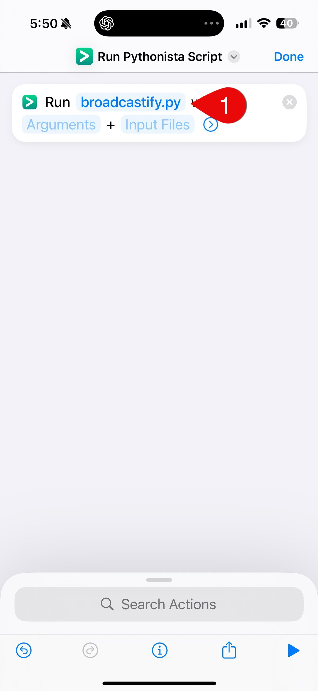
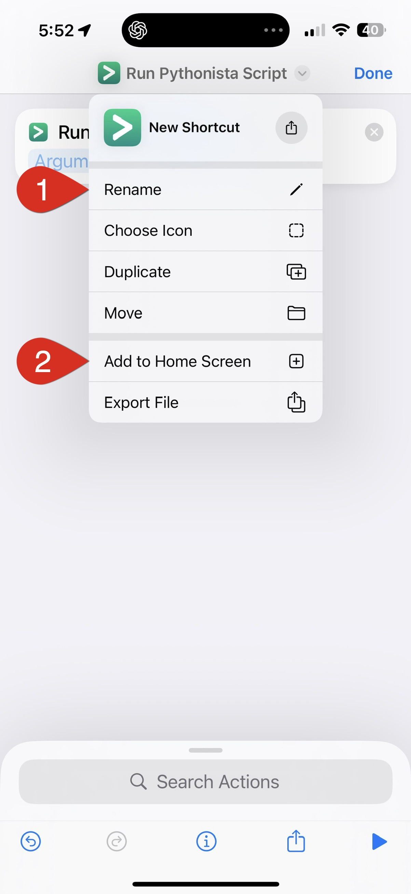

## Screenshots

### Installation

### Apple/Siri Shortcut
1. Open the **Shortcuts** app:  
   - Tap **+** to create a new shortcut  
   - Add the **Run Pythonista Script** action  
   - Choose `broadcastify.py`
   - You can add this shortcut to your Home Screen or ask **Siri** to run it
     

         
        
     

